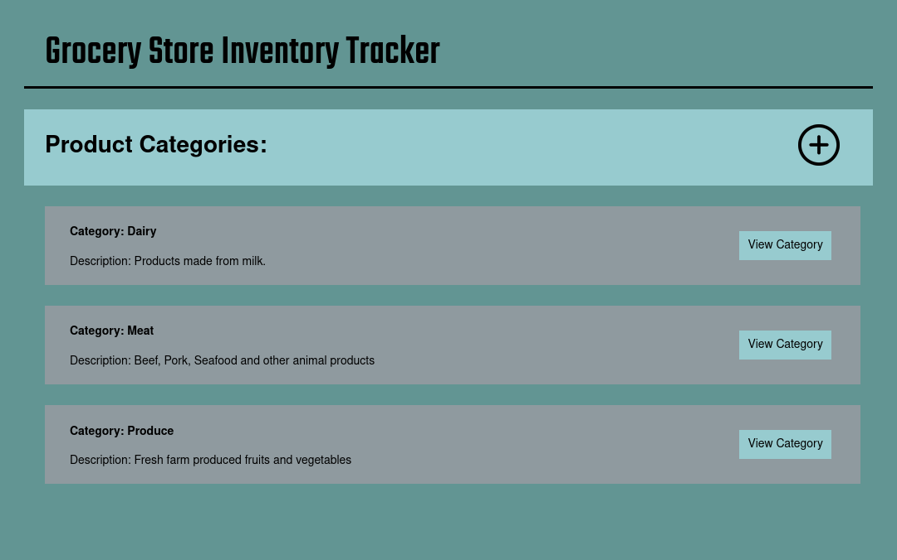

# Inventory Tracker 

View the project live [here](https://intense-crag-59359.herokuapp.com/home).

#### About this project.

Completed for [The Odin Project](https://www.theodinproject.com/lessons/nodejs-inventory-application) Node / Express Course.

This simple web application is an 'inventory tracker' that allows you to Create / Read / Update and Delete 
different categories and products contained therein. Any user can create a new category or product, but a password must be entered to perform any deletions.

The application styling is pretty boring, but I spent my daily creativity allowance over at my [Midieval Themed Message Board](https://github.com/brenton-j-andrews/message_board), so what can you do.

-----

#### Frameworks

This project was built using Node / Express, Mongoose, MongoDB and the Pug templating engine.

----- 
#### Takeaways

This project was my first taste of backend programming outside of following tutorials. 
I gained some familiarity with various Express features and modules, learned how to use environmental variables with Node,
performed CRUD operations on a NOSQL database, 
and applied what I learned about the model-view-controller design pattern. 

My biggest takeaway was accidentally using git rebase and deleting some work that I had done. Definitely learn a bit about proper git usage when that happens, so maybe it was a good thing after all!
